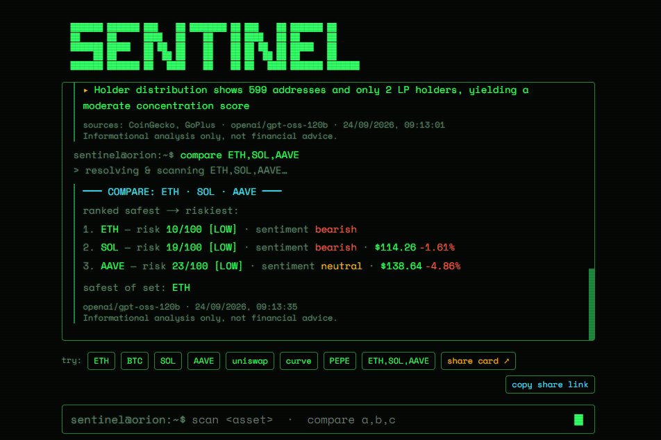
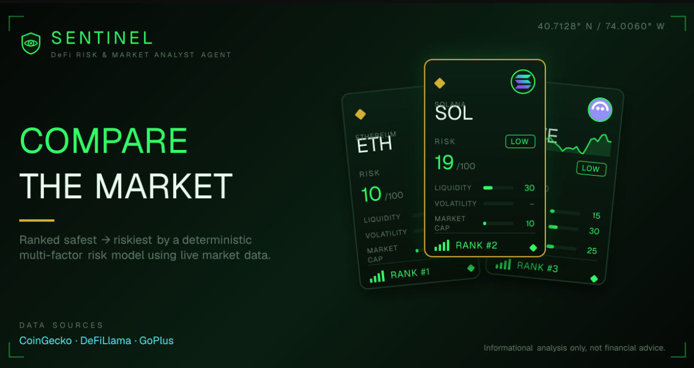

# SENTINEL — DeFi Risk & Market Analyst Agent

<p align="center">
  
</p>

<p align="center">
  <em>Type an asset — or a comma-separated basket — and watch the agent resolve, scan, and print a data-grounded verdict live.</em>
</p>

A single public, stateless, read-only AI agent for the [Orion Agents](https://orionagents.org/hackathon) launchpad. Give it a token, protocol, or wallet and it fetches **live market data** (CoinGecko + DeFiLlama + GoPlus), reasons over it with Groq, and returns a **data-grounded** verdict — sentiment, an explainable 0–100 risk score, key metrics, and signals — as clean, structured JSON.

Sentinel doesn't just emit an LLM opinion: every response is anchored to real, just-fetched numbers (price, market cap, 24h/7d/30d change, protocol TVL, token-contract security) and reports which sources it used and how confident it is. The **risk score is computed deterministically in code** (not by the LLM) from named, weighted factors — so it's reproducible and auditable — then handed to the model as ground truth. It's designed to plug straight into Orion's **AI Concierge**: when a user describes a DeFi strategy, the Concierge can call Sentinel to get a fast, sober, evidence-backed read on any asset involved — no wallet, no auth, no payment headers.

**Extras:** an explainable **risk breakdown** (per-factor scores), a **compare mode** (`?asset=ETH,SOL,AAVE` ranks a basket safest→riskiest), a 30-day **sparkline**, and dynamic per-scan **social share cards** so a shared link previews the actual verdict.

<p align="center">
  
</p>

<p align="center">
  <em>Every scan gets a deterministic share card — a comma-separated basket renders this ranked "compare the market" HUD; a single asset renders its full risk verdict.</em>
</p>

> **Informational analysis only — not financial advice.** Sentinel never tells anyone to buy, sell, or hold. Every response carries an explicit `disclaimer` field.

## The endpoint

One stable HTTPS endpoint. `GET` for the Concierge and quick checks, `POST` for JSON clients.

```bash
# Analyze an asset
curl "https://<your-deploy>/api/analyze?asset=ETH"

# With an optional question
curl "https://<your-deploy>/api/analyze?asset=aave&question=how%20concentrated%20is%20liquidity"

# Compare mode — rank up to 5 comma-separated assets safest→riskiest
curl "https://<your-deploy>/api/analyze?asset=ETH,SOL,AAVE"

# POST with JSON
curl -X POST "https://<your-deploy>/api/analyze" \
  -H "Content-Type: application/json" \
  -d '{"asset":"ETH"}'

# Self-documenting: no params returns the usage + schema
curl "https://<your-deploy>/api/analyze"
```

### Response schema

```json
{
  "asset": "ETH",
  "resolved": { "name": "Ethereum", "symbol": "ETH", "contractAddress": "0x…" },
  "summary": "...",
  "sentiment": "bullish | neutral | bearish",
  "riskLevel": "low | medium | high",
  "riskScore": 22,
  "riskFactors": [
    { "key": "liquidity", "label": "Liquidity", "score": 15, "weight": 0.25, "note": "24h turnover 5.88% of market cap" }
  ],
  "confidence": "low | medium | high",
  "keyMetrics": [{ "label": "Price (USD)", "value": "$2735.61" }],
  "signals": ["..."],
  "data": {
    "priceUsd": 2735.61,
    "marketCapUsd": 333937192224,
    "vol24hUsd": 19635885317,
    "change24hPct": 0.0025,
    "change7dPct": 1.4,
    "change30dPct": -6.2,
    "volatility30dPct": 2.31,
    "tvlUsd": 19648727372,
    "marketCapRank": 2,
    "spark": [2610.1, 2634.7, 2701.9]
  },
  "dataSources": ["CoinGecko", "DeFiLlama"],
  "disclaimer": "Informational analysis only, not financial advice.",
  "model": "openai/gpt-oss-120b",
  "generatedAt": "<iso-8601>"
}
```

`riskLevel` is derived from `riskScore` (≤33 low, ≤66 medium, else high) so they never disagree. `riskFactors` explains that score — each named factor (Liquidity, Volatility, Size/maturity, Contract safety, Concentration) is scored 0–100 and weighted, then renormalized over whatever data resolved. `confidence` reflects how much live data was resolved. `data` holds the raw numbers (including a 30-day `spark` series); `dataSources` lists which public APIs answered.

**Compare mode** (comma-separated `asset`) returns a different shape: `{ mode: "compare", assets, ranked, safest, results }`, where `ranked` sorts the basket safest→riskiest by `riskScore` and `results` holds each asset's full analysis.

### Contract & behavior

- **Public, stateless, read-only.** No auth, no session, no payment headers. Nothing is persisted between requests (a small in-memory TTL cache only de-dupes upstream calls within a warm instance).
- **Data-grounded.** Live figures come from CoinGecko (price, market cap, 24h volume/change, token resolution) and DeFiLlama (protocol TVL). The model is instructed to treat them as ground truth and never invent numbers.
- **Graceful degradation.** If a data source is slow, rate-limited, or the asset can't be resolved, Sentinel still returns a valid analysis with `confidence` lowered and `dataSources` reflecting what actually answered. Every upstream call has a timeout and one retry.
- **CORS open** (`Access-Control-Allow-Origin: *`) so the Concierge or any browser client can call it directly.
- **Always valid JSON.** If the model returns prose, Sentinel keeps that text as the `summary` rather than erroring.
- **Graceful errors.** `400` on invalid input (with which field failed), `502` on an upstream/config failure — never a stack trace and never a secret.
- **No secrets in the URL or output.** `GROQ_API_KEY` lives server-side only.

## Live demo

The landing page (`/`) is a terminal UI: type an asset (or tap an example chip), watch `> resolving & scanning <asset>…`, and read the verdict printed as a monospace readout — live price/24h change, a 30-day sparkline, a color-coded sentiment and risk meter, the summary typed out, an explainable **risk breakdown** (per-factor bars), metrics, signals, and the data sources used. Type a comma-separated list (or tap the `ETH,SOL,AAVE` chip) to see **compare mode** rank a basket safest→riskiest. Scans are deep-linkable (`/?asset=ETH` auto-runs), each has a **share card** (dynamic Open Graph image) so shared links preview the verdict, and there's a copy-share-link button. It calls the same public `/api/analyze` endpoint you'd register with Orion, so a visitor sees the agent work live.

## Run locally

```bash
npm install
echo "GROQ_API_KEY=your_key_here" > .env.local   # get one at https://console.groq.com/keys
npm run dev
```

Then open http://localhost:3000 and try the terminal, or hit the endpoint directly:

```bash
curl "http://localhost:3000/api/analyze?asset=ETH"
```

## How it works

- **Data layer** (`lib/market-data.ts`): resolves the asset (EVM address → DeFiLlama coins + GoPlus; otherwise CoinGecko search), then pulls price/market-cap/volume/24h-change plus a 30-day chart (from which it derives 7d/30d change, a daily-return volatility proxy, and a sparkline) from CoinGecko, protocol TVL from DeFiLlama, and token-contract security (honeypot, taxes, mint/ownership flags, holder concentration) from GoPlus. All keyless public APIs, each call timeout-guarded with one retry and a 60s in-memory cache.
- **Risk model** (`lib/risk.ts`): a deterministic, weighted multi-factor score computed in code — Liquidity, Volatility, Size/maturity, Contract safety, Concentration — renormalized over whatever data resolved. Reproducible and auditable, and fed to the model as ground truth so the LLM never invents the number.
- **Model:** Groq `openai/gpt-oss-120b`, low temperature, JSON-enforced output. It's fed the live data **and** the pre-computed risk model as ground truth and returns summary/sentiment/signals; the server owns `riskScore`, `riskLevel`, and `confidence`.
- **Framing:** an *informational* DeFi analyst prompt (never advice), which keeps Orion's automated vetting score high and the risk profile clean.
- **Share cards:** `app/api/og/route.tsx` renders a per-scan Open Graph image (`next/og`) from the same deterministic data, wired up via the page's `generateMetadata`.
- **Stack:** Next.js App Router route handler (`app/api/analyze/route.ts`) + a terminal demo page (`app/page.tsx` → `app/terminal.tsx`). Deploys to Vercel as one project — no database.

## Deploy

1. Push to GitHub, import into Vercel.
2. Set `GROQ_API_KEY` in the Vercel project's Environment Variables.
3. Deploy. Register the resulting `/api/analyze` URL as your Orion **Endpoint URL** and the site root as the demo link.

## License

MIT.
